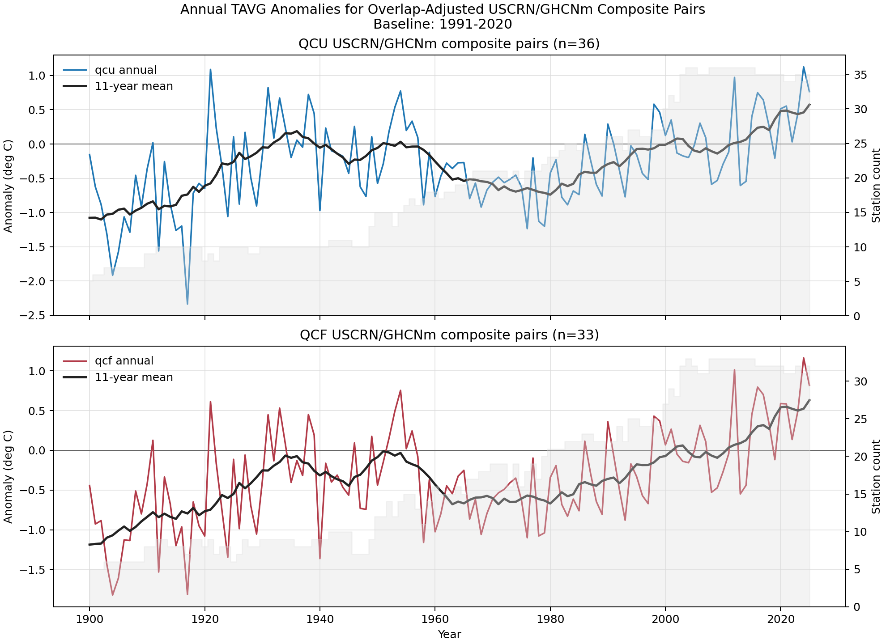
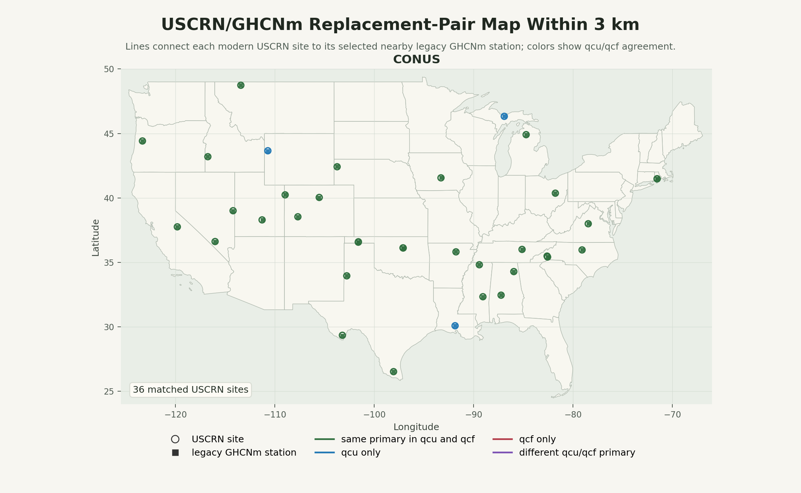
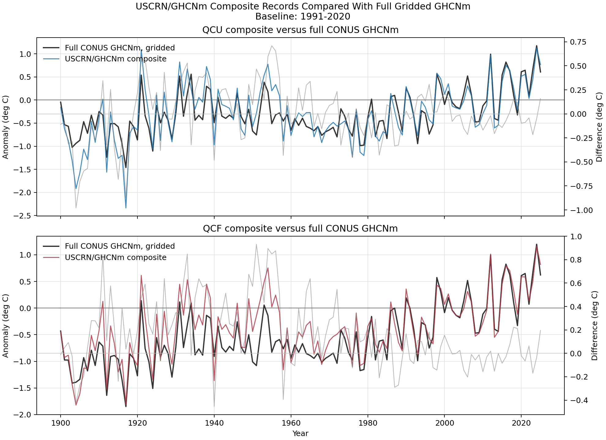

# USCRN Replacement-Pair Temperature Composite, 1900-Present
## USer Promt summary

Create a self-contained Python workflow to analyze whether USCRN sites have nearby legacy GHCNm v4 monthly TAVG stations.

Goal:
Find all USCRN stations where a legacy GHCNm station existed within 3 km before the USCRN site became operational, then plot temperature anomalies for those matched legacy stations.

Requirements:
1. Use official NOAA/NCEI sources only.
2. Download and process GHCNm v4 monthly TAVG archives separately:
   - qcu
   - qcf
3. Use the GHCNm `.inv` file for station metadata, location, name, and coverage.
4. Use official USCRN station metadata for:
   - station name
   - latitude/longitude
   - operational/installation date
5. Match stations by:
   - normalized station name similarity
   - distance under 3 km
   - valid legacy observations before USCRN installation
6. Keep qcu and qcf fully separate through:
   - parsing
   - matching
   - anomaly calculation
   - outputs
7. Investigate anomaly baselines instead of hard-coding one:
   - 1901–2000
   - 1951–1980
   - 1981–2010
   - 1991–2020
8. Choose the main baseline based on station retention and sensitivity.
9. Produce:
   - match tables for qcu and qcf
   - primary match tables
   - qcu/qcf comparison table
   - baseline sensitivity table
   - annual anomaly CSVs
   - one combined figure with qcu and qcf panels
10. Plot annual TAVG anomalies for legacy GHCNm stations within 3 km of USCRN sites.
11. Add parser smoke tests and a README.
12. Record source URLs, retrieval metadata, assumptions, and caveats.
13. Use clear, auditable Python. Avoid obscure shell commands.

Expected output:
A runnable script, e.g. `uscrn_ghcn_anomaly.py`, plus `README.md`, producing CSV outputs and a combined anomaly plot under an `outputs/` directory.

Important interpretation:
“Historic USCRN sites” means USCRN sites that can be linked to nearby legacy GHCNm monthly TAVG stations within 3 km, with valid pre-installation observations.

Agent hierarchy:
- Lead Workflow Architect: final integration, reproducibility, CLI, acceptance criteria.
- Data Acquisition Agent: NOAA downloads, source metadata, local data layout.
- Archive Parsing Agent: parse GHCNm `.inv` and `.dat` files for qcu and qcf.
- USCRN Metadata Agent: parse USCRN names, coordinates, and operational dates.
- Station Matching Agent: match by name similarity plus <3 km distance.
- Historical Eligibility Agent: require valid observations before USCRN installation.
- Anomaly Computation Agent: compute monthly/annual anomalies and baseline sensitivity.
- Plotting Agent: create combined qcu/qcf figure and supporting tables.
- Validation Agent: check distances, dates, coverage, qcu/qcf differences.
- Documentation Agent: write README, assumptions, caveats, and provenance.

## Conclusion

This run asks a narrow replacement question: where a modern USCRN station sits very close to an older GHCNm station, can the two records be joined into one defensible local history? With a 3.0 km radius, the screen finds 36 qcu and 33 qcf station pairs out of 117 contiguous U.S. CRN sites. Each retained pair has at least 12 overlapping months, at least 2 overlap years meeting the valid-month rule, and passes the gap/fragmentation screen.

The resulting composite records show recent temperatures above the 1991-2020 reference period: the 2021-2025 mean anomaly is 0.59 deg C in qcu and 0.64 deg C in qcf.

Against the full contiguous U.S. GHCNm set, gridded at 5.0 degrees to reduce station clustering, the overlap-qualified USCRN composite is close in recent decades. For 2001-2025, the composite-minus-full difference is -0.06 deg C in qcu and -0.01 deg C in qcf. Composite/full annual correlations are 0.881 for qcu and 0.876 for qcf.

All annual results shown here start in 1900. That keeps a few very early legacy records from dominating the story, but the earliest decades still have fewer contributing station pairs. The strongest use of this product is the well-populated 20th-century and modern overlap period, not a site-by-site claim about every CRN station.

## Figures

- Temperature anomaly plot: `outputs/figures/uscrn_legacy_tavg_anomaly_1991_2020.png`
- Match map: `outputs/figures/uscrn_legacy_station_match_map.png`
- Composite versus full gridded comparison: `outputs/figures/uscrn_composite_vs_full_conus_tavg_anomaly_1991_2020.png`







## Data And Method

- USCRN station metadata came from the NOAA/NCEI CRN station listing.
- Legacy monthly temperature came from NOAA/NCEI GHCNm v4 TAVG `qcu` and `qcf` archives.
- `qcu` is the unadjusted GHCNm monthly product; `qcf` is the adjusted/final GHCNm product. The workflow keeps them separate through parsing, matching, anomaly calculation, and plotting.
- The geography filter for this run is `conus`, so Alaska and Hawaii are excluded by default.
- A USCRN site qualified as a composite pair when a U.S. GHCNm station was within 3.0 km, had pre-USCRN observations, and overlapped the USCRN monthly record for at least 12 valid months.
- The USCRN modern leg uses `T_MONTHLY_MEAN` from NOAA's monthly01 product.
- The legacy GHCNm leg is shifted onto the USCRN level by the mean USCRN-minus-GHCNm difference during overlap, then USCRN monthly values are used for the modern segment.
- The full comparison uses all GHCNm stations inside the same geography, gridded to 5.0-degree cells before annual averaging.
- Station matching selected a primary legacy station per USCRN site by name score first, then distance and pre-install record length.
- Annual anomalies require at least 9 valid monthly anomalies in a station-year.
- Annual outputs, plots, report statistics, and fragmentation-span checks start at 1900.
- Baselines tested: 1901-2000, 1951-1980, 1981-2010, and 1991-2020.
- Main baseline selected by station retention and sensitivity: 1991-2020.

## Match Coverage

- Contiguous U.S. CRN sites analyzed: 117.
- qcu found 50 overlap-qualified legacy matches and 36 primary composite station pairs.
- qcf found 49 overlap-qualified legacy matches and 33 primary composite station pairs.
- Fragmentation screening excluded 8 qcu and 10 qcf primary overlap pairs.
- In the main baseline calculation, qcu retained 36 composite pairs and qcf retained 33 composite pairs.
- Median primary-pair distance was 0.95 km in qcu and 0.99 km in qcf.
- Name matching flagged 22 qcu primary matches and 20 qcf primary matches as clear name matches; the rest are nearby legacy stations accepted by the distance, overlap, and pre-installation rules.
- Full contiguous U.S. GHCNm pool: 12225 qcu stations and 12225 qcf stations before baseline screening.
- Full gridded baseline-retained pool: 6936 qcu stations and 6614 qcf stations.

## Best Replacement Pairs

These are the highest-scoring retained pairs to review first. The score favors short station distance, more valid overlap years, lower overlap RMS difference after the mean offset, continuous year coverage, shorter internal gaps, and stronger name agreement.

| Rank | Product | USCRN Site | GHCNm Station | Score | Distance km | Overlap Years | Overlap RMS deg C | Max Gap |
|---:|---|---|---|---:|---:|---:|---:|---:|
| 1 | qcu | RI Kingston 1 NW | USC00374266 KINGSTON | 89.7 | 0.260 | 24 | 0.301 | 0 |
| 2 | qcf | NV Mercury 3 SSW | USW00003160 MERCURY_DESERT_ROCK_AP | 87.0 | 0.699 | 22 | 0.218 | 0 |
| 3 | qcu | NV Mercury 3 SSW | USW00003160 MERCURY_DESERT_ROCK_AP | 87.0 | 0.699 | 22 | 0.218 | 0 |
| 4 | qcf | NC Durham 11 W | USR0000NDUK DUKE_FOREST_NORTH_CAROLINA | 87.0 | 0.398 | 19 | 0.183 | 0 |
| 5 | qcu | NC Durham 11 W | USR0000NDUK DUKE_FOREST_NORTH_CAROLINA | 87.0 | 0.398 | 19 | 0.183 | 0 |
| 6 | qcf | RI Kingston 1 NW | USC00374266 KINGSTON | 86.7 | 0.260 | 24 | 0.335 | 2 |
| 7 | qcu | MI Gaylord 9 SSW | USC00203099 GAYLORD_9SSW | 84.7 | 0.323 | 17 | 0.379 | 0 |
| 8 | qcf | NE Harrison 20 SSE | USR0000NAGA AGATE_NEBRASKA | 84.5 | 0.654 | 19 | 0.237 | 0 |
| 9 | qcu | RI Kingston 1 W | USC00374266 KINGSTON | 84.2 | 1.174 | 24 | 0.301 | 0 |
| 10 | qcf | OR Corvallis 10 SSW | USR0000OFIN FINELY_NWR_OREGON | 83.2 | 0.418 | 18 | 0.209 | 1 |
| 11 | qcu | OR Corvallis 10 SSW | USR0000OFIN FINELY_NWR_OREGON | 83.2 | 0.418 | 18 | 0.209 | 1 |
| 12 | qcu | TX Muleshoe 19 S | USC00416137 MULESHOE_NTL_WR | 82.6 | 0.987 | 22 | 0.401 | 0 |

## Fragmentation Screening

- A valid station-year requires at least 9 valid months.
- A valid overlap requires at least 2 such years and at least 12 total overlapping months.
- A retained composite may have at most 3 consecutive missing valid years and at most 0.20 missing valid-year fraction across its span.

Retention sensitivity for 9 valid months per year:

| Product | Max Missing-Year Run | Candidate Pairs | Passing Pairs | Median Missing-Year Fraction |
|---|---:|---:|---:|---:|
| qcu | 0 | 44 | 21 | 0.000 |
| qcu | 1 | 44 | 29 | 0.000 |
| qcu | 2 | 44 | 35 | 0.000 |
| qcu | 3 | 44 | 36 | 0.000 |
| qcu | 5 | 44 | 38 | 0.000 |
| qcu | 10 | 44 | 41 | 0.000 |
| qcf | 0 | 43 | 8 | 0.000 |
| qcf | 1 | 43 | 17 | 0.013 |
| qcf | 2 | 43 | 26 | 0.020 |
| qcf | 3 | 43 | 33 | 0.043 |
| qcf | 5 | 43 | 36 | 0.046 |
| qcf | 10 | 43 | 39 | 0.050 |

## Temperature Results

- The common annual series spans 1900-2025 for 126 years.
- qcu and qcf annual anomalies have a correlation of 0.965 over common years.
- The mean qcf-minus-qcu anomaly difference is -0.06 deg C over the full common record and 0.05 deg C for 2001-2025.
- For 1991-2020, mean anomaly is -0.01 deg C in qcu and -0.02 deg C in qcf.
- For 2011-2020, mean anomaly is 0.21 deg C in qcu and 0.27 deg C in qcf.
- Latest annual anomaly, 2025: 0.77 deg C in qcu with 35 stations; 0.82 deg C in qcf with 32 stations.

## Composite Versus Full Gridded Network

- qcu composite/full common years: 126; correlation 0.881; mean composite-minus-full difference -0.00 deg C.
- qcf composite/full common years: 126; correlation 0.876; mean composite-minus-full difference 0.17 deg C.
- For 2021-2025, full gridded mean anomaly is 0.63 deg C in qcu and 0.64 deg C in qcf.

## Baseline Sensitivity

- qcu 1901-2000: 25 eligible primary sites, 126 annual years, sensitivity MAE 0.20 deg C.
- qcu 1951-1980: 19 eligible primary sites, 126 annual years, sensitivity MAE 0.24 deg C.
- qcu 1981-2010: 26 eligible primary sites, 126 annual years, sensitivity MAE 0.19 deg C.
- qcu 1991-2020: 36 eligible primary sites, 126 annual years, sensitivity MAE 0.35 deg C.
- qcf 1901-2000: 23 eligible primary sites, 126 annual years, sensitivity MAE 0.24 deg C.
- qcf 1951-1980: 17 eligible primary sites, 126 annual years, sensitivity MAE 0.23 deg C.
- qcf 1981-2010: 24 eligible primary sites, 126 annual years, sensitivity MAE 0.21 deg C.
- qcf 1991-2020: 33 eligible primary sites, 126 annual years, sensitivity MAE 0.38 deg C.

The selected baseline is 1991-2020; it maximized composite-pair retention under the current ranking rule while still producing an annual composite suitable for qcu/qcf comparison.

## Caveats

- This is a paired-station composite, not a raw USCRN-only trend.
- The full-network comparison is grid-cell averaged to reduce station clustering, but it is not a formal area-weighted climate reanalysis.
- Early years are spatially sparse; pair count is shown in the anomaly figure for that reason.
- qcu is unadjusted while qcf is adjusted. Differences between them are expected and should not be treated as an error.
- Nearby does not always mean identical siting or exposure. The match tables should be reviewed before site-level claims.
- NOAA `latest` archives are mutable; source metadata is recorded to preserve what was used in this run.

## Source Metadata

- `uscrn_station_listing.html`: https://www.ncei.noaa.gov/access/crn/station-listing; size 88075 bytes; last modified `None`; retrieved `None`.
- `ghcnm_readme.txt`: https://www.ncei.noaa.gov/pub/data/ghcn/v4/readme.txt; size 11978 bytes; last modified `None`; retrieved `None`.
- `ghcnm.tavg.latest.qcu.tar.gz`: https://www.ncei.noaa.gov/pub/data/ghcn/v4/ghcnm.tavg.latest.qcu.tar.gz; size 45862382 bytes; last modified `None`; retrieved `None`.
- `ghcnm.tavg.latest.qcf.tar.gz`: https://www.ncei.noaa.gov/pub/data/ghcn/v4/ghcnm.tavg.latest.qcf.tar.gz; size 44108831 bytes; last modified `None`; retrieved `None`.
- `uscrn_monthly/readme.txt`: https://www.ncei.noaa.gov/pub/data/uscrn/products/monthly01/readme.txt; size 12618 bytes; last modified `None`; retrieved `None`.
- `uscrn_monthly/headers.txt`: https://www.ncei.noaa.gov/pub/data/uscrn/products/monthly01/headers.txt; size 1445 bytes; last modified `None`; retrieved `None`.
- `uscrn_monthly/index.html`: https://www.ncei.noaa.gov/pub/data/uscrn/products/monthly01/; size 43034 bytes; last modified `None`; retrieved `None`.
- `uscrn_monthly/CRNM0102-*.txt`: 237 station files; total size 4751976 bytes.

## Reproduce

```powershell
python uscrn_ghcn_anomaly.py run
```

Use `python uscrn_ghcn_anomaly.py run --download` to refresh NOAA/NCEI inputs after approving network access.
